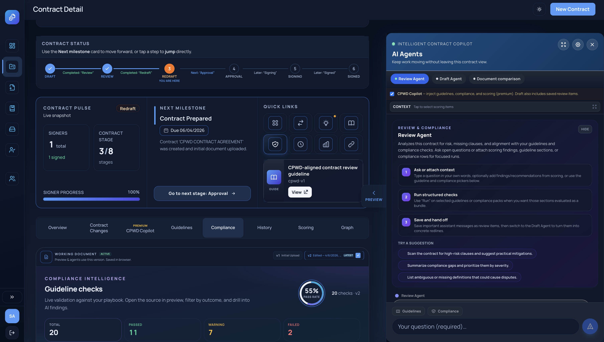

# Contract Lifecycle Management (CLM) System

## Architecture
- **Backend**: FastAPI with Python 3.13 and `uv` package manager.
- **Frontend**: Vue.js 3 with Vite and Tailwind CSS.
- **Database**: SQLite (managed with SQLAlchemy and Alembic).
- **Deployment**: Docker Compose.



---
## Running the Application
To start the entire system:
```bash
docker-compose up --build
```
- Frontend: `http://localhost:8080`
- Backend API: `http://localhost:8000`
- API Docs: `http://localhost:8000/docs`

## Database Migrations
We use Alembic to handle database schema changes.

### Creating a New Migration
When you modify `backend/app/models/models.py`, generate a new migration version:
```bash
# Enter the backend container
docker-compose exec backend bash

# Generate migration
./generate_migration.sh "Description of changes"

# Exit the container
exit

# Important: Commit the new migration file in backend/migrations/versions/
```

### Applying Migrations
Migrations are automatically applied on container startup via `entrypoint.sh`. To manually apply them:
```bash
docker-compose exec backend uv run alembic upgrade head
```
