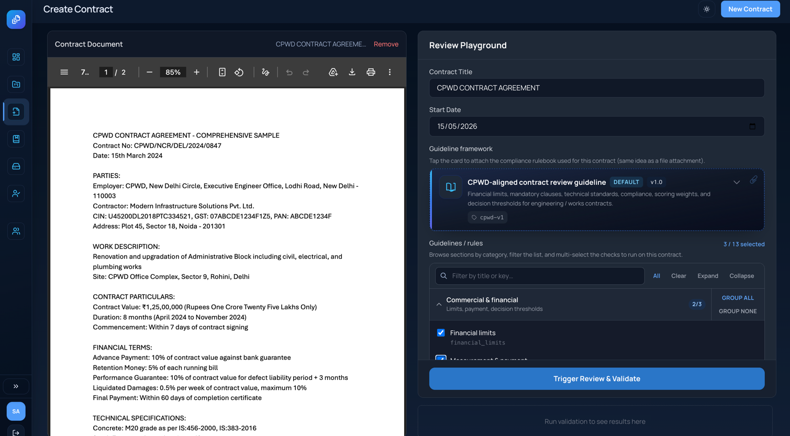
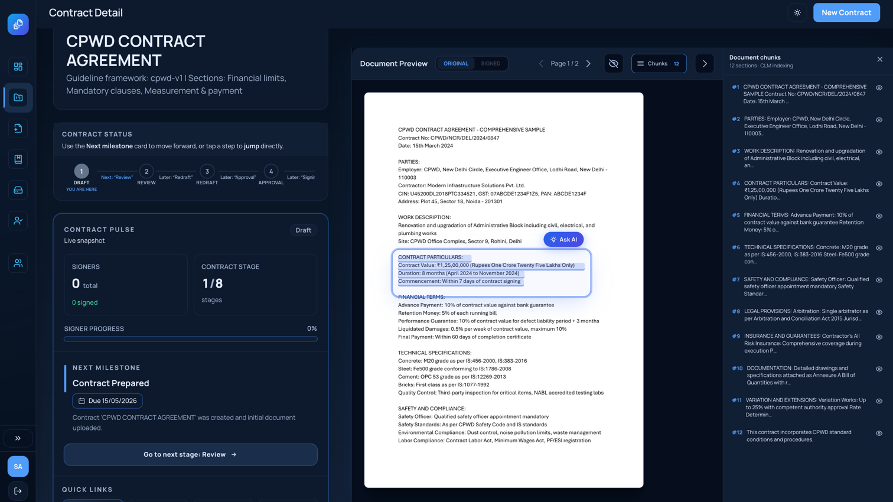
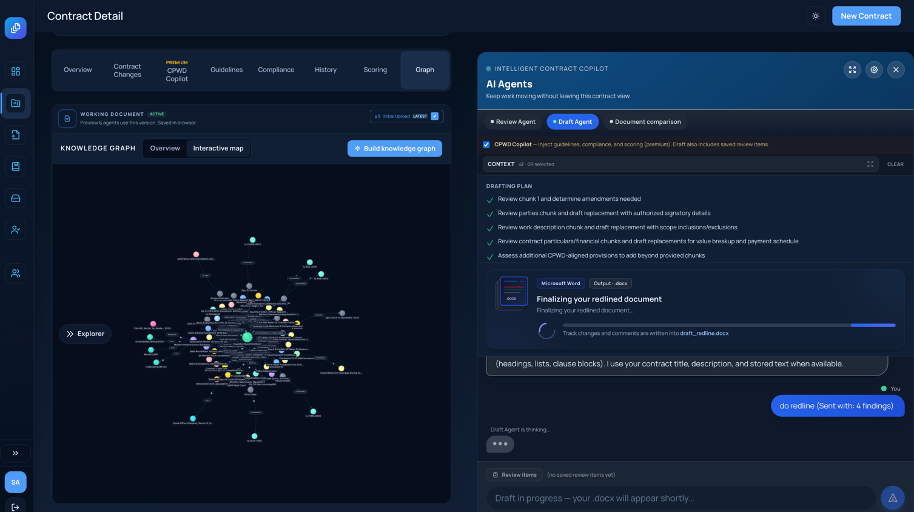
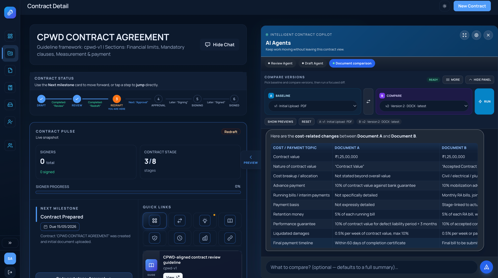
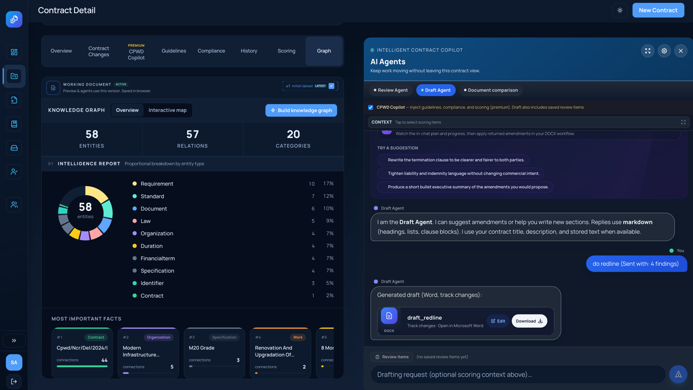
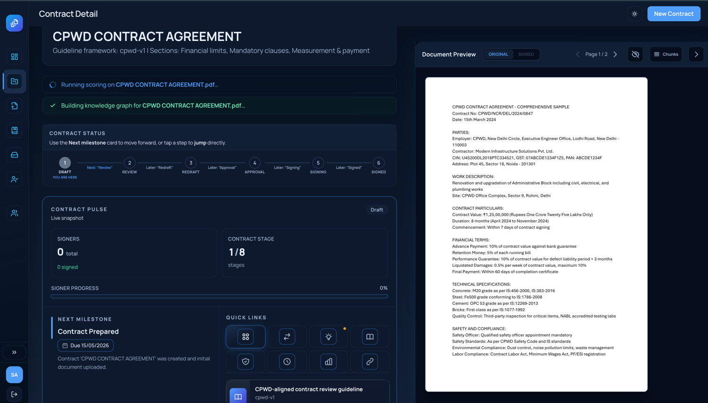
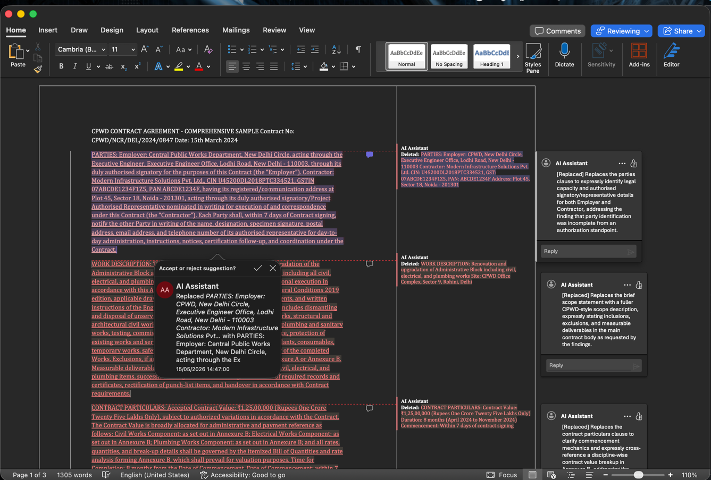
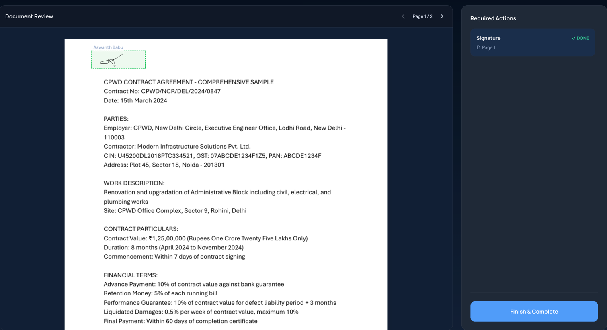
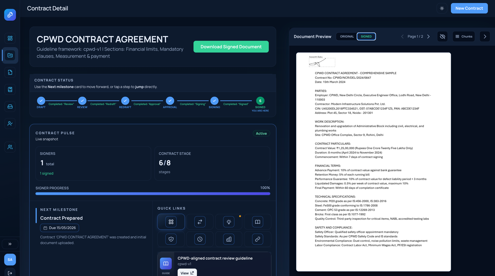

# 📜 Contract Lifecycle Management (CLM) System

[](https://fastapi.tiangolo.com/)
[](https://vuejs.org/)
[](https://tailwindcss.com/)
[](https://www.sqlite.org/)
[](https://www.docker.com/)

An intelligent, AI-powered system designed to streamline the entire lifecycle of your contracts—from initial upload and redlining to secure electronic signatures and version tracking.

---

## ✨ Key Features

The CLM system provides a comprehensive set of features for managing the lifecycle of contracts:

| | | |
|:---:|:---:|:---:|
| **📄 File Upload** <br>  <br> *Easily upload your contract documents.* | **🤖 Ask AI** <br>  <br> *Leverage AI to ask questions about contracts.* | **📊 Knowledge Graph** <br>  <br> *Visualize relationships and entities.* |
| **🔍 Document Comparison** <br>  <br> *Compare different versions of a document.* | **🖊️ Redlining** <br>  <br> *Mark up and suggest changes.* | **🧐 Review Mode** <br>  <br> *Specialized mode for reviewing terms.* |
| **📝 Redline Review Mode** <br>  <br> *Combined view for reviewing redlines.* | **🔏 Document Signing** <br>  <br> *Securely sign documents.* | **📜 Signed Version Tracking** <br>  <br> *Keep track of signed versions.* |

---

## 🏗️ Architecture

- **Backend**: [FastAPI](https://fastapi.tiangolo.com/) with **Python 3.13** and `uv` package manager.
- **Frontend**: [Vue.js 3](https://vuejs.org/) with **Vite** and **Tailwind CSS**.
- **Database**: **SQLite** (managed with **SQLAlchemy** and **Alembic**).
- **Deployment**: **Docker Compose** for seamless orchestration.

---

## 🚀 Getting Started

### Prerequisites
- [Docker](https://www.docker.com/get-started) and [Docker Compose](https://docs.docker.com/compose/install/)

### Running the Application
To start the entire system:
```bash
docker-compose up --build
```

- **Frontend**: [http://localhost:8080](http://localhost:8080)
- **Backend API**: [http://localhost:8000](http://localhost:8000)
- **API Docs**: [http://localhost:8000/docs](http://localhost:8000/docs)

---

## 🛠️ Development

### Database Migrations
We use **Alembic** to handle database schema changes.

#### Creating a New Migration
When you modify `backend/app/models/models.py`, generate a new migration version:
1. **Enter the backend container**:
   ```bash
   docker-compose exec backend bash
   ```
2. **Generate migration**:
   ```bash
   ./generate_migration.sh "Description of changes"
   ```
3. **Exit the container**:
   ```bash
   exit
   ```
*Note: Remember to commit the new migration file in `backend/migrations/versions/`.*

#### Applying Migrations
Migrations are automatically applied on container startup. To manually apply them:
```bash
docker-compose exec backend uv run alembic upgrade head
```
